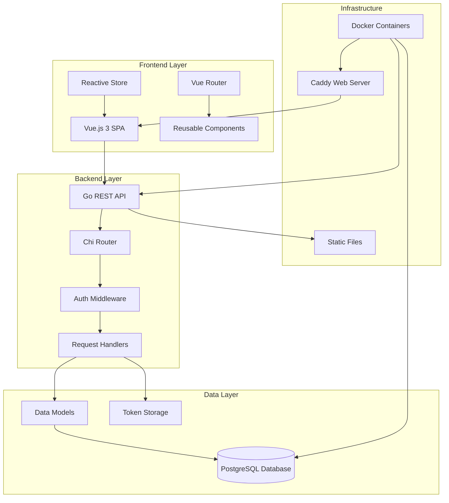
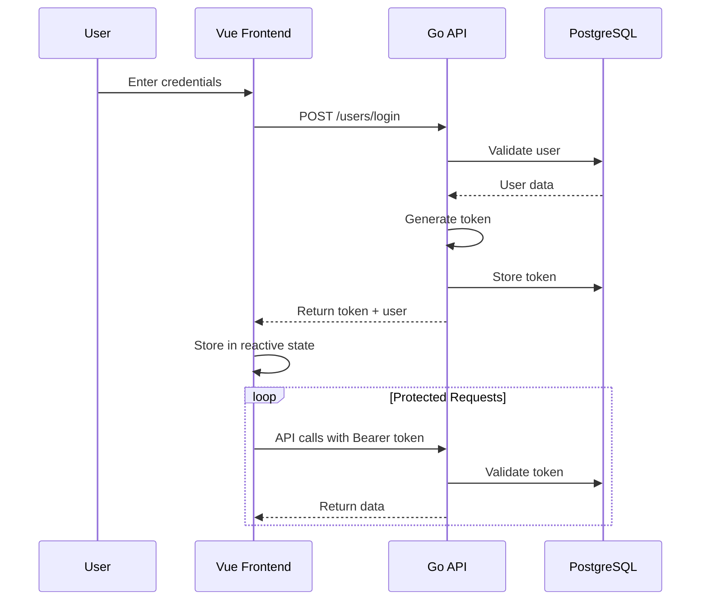
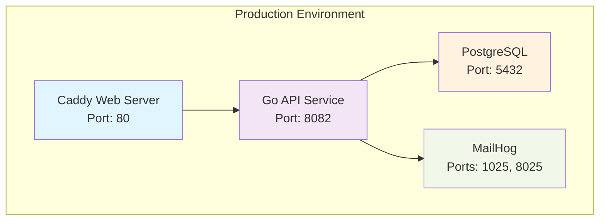

# Vue & Go Full-Stack Book Management System

A modern full-stack web application for managing books and users, built with **Vue.js 3** frontend and **Go** backend API. The system provides comprehensive book management, user authentication, and administrative functionality with a clean, maintainable architecture.

## 🎯 Project Overview

This project demonstrates a complete full-stack application architecture with:
- **Frontend**: Vue.js 3 with Composition API for reactive user interface
- **Backend**: Go with Chi router for high-performance REST API
- **Database**: PostgreSQL with connection pooling and migrations
- **Authentication**: Token-based authentication with secure password hashing
- **Deployment**: Docker containerization for both services

## 🏗️ System Architecture



## 🚀 Quick Start Guide

### Prerequisites
- **Go** 1.21+
- **Node.js** 16+
- **Docker** & **Docker Compose**
- **PostgreSQL** 13+ (or use Docker)

### 1. Clone Repository
```bash
git clone <repository-url>
cd vue_and_go
```

### 2. Start Backend Services
```bash
cd api
docker-compose up -d  # Starts PostgreSQL and MailHog
make run              # Start Go API server
```

### 3. Start Frontend Development
```bash
cd vue-app
npm install
npm run serve         # Start Vue development server
```

### 4. Access Applications
- **Frontend**: http://localhost:8080
- **Backend API**: http://localhost:8082
- **Database**: localhost:5432 (postgres/password)
- **MailHog**: http://localhost:8025

## 📁 Project Structure

```
vue_and_go/
├── api/                          # Backend Go Application
│   ├── cmd/api/                  # Application entry point
│   │   ├── main.go              # Main application entry
│   │   ├── handlers.go          # HTTP request handlers
│   │   ├── routes.go            # API route definitions
│   │   ├── middleware.go        # Authentication middleware
│   │   └── helpers.go           # Utility functions
│   ├── internal/                # Private application packages
│   │   ├── data/               # Data access layer
│   │   │   ├── model.go        # Core models and DB connection
│   │   │   └── books.go        # Book-specific data operations
│   │   └── driver/             # Database drivers
│   │       └── driver.go       # PostgreSQL connection setup
│   ├── db-data/                # Database configuration
│   ├── static/                 # Static file serving
│   ├── docker-compose.yml      # Backend services
│   ├── Makefile               # Build automation
│   └── README.md              # Backend documentation
│
├── vue-app/                     # Frontend Vue.js Application
│   ├── src/
│   │   ├── components/         # Vue components
│   │   │   ├── forms/         # Reusable form components
│   │   │   ├── Book*.vue      # Book management components
│   │   │   ├── User*.vue      # User management components
│   │   │   ├── Login*.vue     # Authentication components
│   │   │   ├── security.js    # Authentication utilities
│   │   │   └── store.js       # Application state
│   │   ├── router/
│   │   │   └── index.js       # Application routing
│   │   ├── App.vue            # Root component
│   │   └── main.js            # Application bootstrap
│   ├── public/                # Static assets
│   ├── docker-compose.yml     # Frontend deployment
│   ├── package.json           # Dependencies and scripts
│   └── README.md             # Frontend documentation
│
├── started_with_vue/           # Vue.js Learning Examples
│   ├── index.html            # Basic Vue concepts
│   ├── fetch.html            # API integration examples
│   ├── registration.html     # Form component examples
│   └── README.md            # Learning guide
│
└── README.md                 # This project overview
```

## 🛠️ Technology Stack

### Frontend Stack
| Technology | Version | Purpose |
|------------|---------|---------|
| **Vue.js** | 3.2.13 | Progressive JavaScript framework |
| **Vue Router** | 4.5.1 | Client-side routing |
| **Vue CLI** | 5.0.0 | Build tooling and development server |
| **Notie.js** | 4.3.1 | User notifications |
| **ESLint** | Latest | Code quality and linting |
| **Caddy** | 2.x | Production web server |

### Backend Stack
| Technology | Version | Purpose |
|------------|---------|---------|
| **Go** | 1.21+ | High-performance backend language |
| **Chi Router** | v5.2.2 | Lightweight HTTP router |
| **PostgreSQL** | 13+ | Primary database |
| **pgx** | Latest | PostgreSQL driver |
| **bcrypt** | Latest | Password hashing |
| **Docker** | Latest | Containerization |

### Infrastructure
| Service | Purpose | Port |
|---------|---------|------|
| **PostgreSQL** | Primary database | 5432 |
| **MailHog** | Email testing | 8025 |
| **Go API** | Backend services | 8082 |
| **Vue Dev Server** | Development frontend | 8080 |
| **Caddy** | Production frontend | 80 |

## 🔐 Authentication & Security

### Authentication Flow


### Security Features
- **Token-based Authentication**: Secure API access with expiring tokens
- **Password Hashing**: bcrypt for secure password storage
- **CORS Protection**: Configured for cross-origin requests
- **Input Validation**: Request payload sanitization
- **Route Guards**: Protected routes with authentication checks
- **SQL Injection Protection**: Parameterized database queries

## 📊 Key Features

### Book Management System
- **Browse Books**: Public book catalog with search and filtering
- **Book Details**: Comprehensive book information with cover images
- **Admin Management**: Full CRUD operations for books
- **Author Management**: Support for multiple authors
- **Genre Classification**: Many-to-many genre relationships
- **Cover Upload**: Image upload and storage system

### User Management
- **User Registration**: Account creation with validation
- **Profile Management**: User profile editing
- **Admin Panel**: Administrative user management
- **Role-based Access**: Different permission levels
- **Session Management**: Secure token-based sessions

### Technical Features
- **Reactive UI**: Real-time updates with Vue 3 reactivity
- **Component Library**: Reusable form and UI components
- **API Integration**: RESTful API communication
- **Error Handling**: Comprehensive error management
- **Responsive Design**: Mobile-friendly interface
- **Hot Reload**: Development server with live updates

## 🐳 Docker Deployment

### Production Deployment
```bash
# Backend services
cd api
docker-compose up -d

# Frontend services  
cd vue-app
npm run build
docker-compose up -d
```

### Development with Docker
```bash
# Full stack with hot reload
docker-compose -f api/docker-compose.yml -f vue-app/docker-compose.dev.yml up
```

### Service Dependencies


## 🧪 Testing

### Backend Testing
```bash
cd api
go test ./...                    # Run all tests
go test -v ./cmd/api/           # Verbose handler tests
go test -cover ./internal/data/ # Coverage for data layer
```

### Frontend Testing
```bash
cd vue-app
npm run lint                    # Code quality checks
npm run test:unit              # Unit tests (if configured)
```

## 📈 Performance & Optimization

### Backend Optimizations
- **Connection Pooling**: Efficient database connections
- **Middleware Pipeline**: Optimized request processing
- **Static File Serving**: Efficient asset delivery
- **Structured Logging**: Performance monitoring
- **Graceful Shutdown**: Clean service termination

### Frontend Optimizations
- **Code Splitting**: Lazy-loaded route components
- **Asset Optimization**: Minified JavaScript and CSS
- **Caching Strategy**: Browser caching headers
- **Bundle Analysis**: Webpack bundle optimization
- **Tree Shaking**: Unused code elimination

## 🔧 Development Workflow

### Backend Development
```bash
cd api
make build                      # Build application
make run                        # Run with hot reload
make test                       # Run test suite
make clean                      # Clean build artifacts
```

### Frontend Development
```bash
cd vue-app
npm run serve                   # Development server
npm run build                   # Production build
npm run lint                    # Code linting
```

### Environment Configuration
```bash
# Backend (.env)
DSN=host=localhost port=5432 user=postgres password=password dbname=books sslmode=disable
ENV=development

# Frontend (.env)
VUE_APP_API_URL=http://localhost:8082
```

## 📚 Learning Resources

### Vue.js Learning Path
The `started_with_vue/` directory contains progressive examples:
1. **Basic Concepts**: Data binding, directives, methods
2. **Components**: Props, events, composition
3. **Forms**: Validation, custom inputs, complex forms
4. **API Integration**: Fetch data, handle responses

### Go Learning Path
Explore the backend codebase:
1. **HTTP Handlers**: Request/response processing
2. **Middleware**: Authentication and CORS
3. **Data Models**: Database operations and validation
4. **Testing**: Unit tests and integration tests

## 🤝 Contributing

### Development Setup
1. Fork the repository
2. Create feature branch: `git checkout -b feature/new-feature`
3. Follow coding standards:
   - **Go**: `gofmt`, `golint`, `go vet`
   - **Vue**: ESLint rules, component conventions
4. Write tests for new functionality
5. Submit pull request with detailed description

### Code Style Guidelines
- **Go**: Follow Go conventions and best practices
- **Vue**: Use Composition API for new components
- **JavaScript**: ESLint configuration with Vue 3 rules
- **Git**: Conventional commit messages

## 🐛 Troubleshooting

### Common Issues

| Issue | Solution |
|-------|----------|
| **Port conflicts** | Change ports in docker-compose.yml |
| **Database connection** | Ensure PostgreSQL is running |
| **CORS errors** | Check API CORS configuration |
| **Build failures** | Clear node_modules, reinstall dependencies |
| **Auth issues** | Verify token expiry and validation |

### Debug Mode
```bash
# Backend debug
cd api
ENV=development make run

# Frontend debug  
cd vue-app
npm run serve -- --mode development
```

## 📄 License

This project is for educational purposes. Please see individual component licenses for specific terms.

## 🔗 Related Documentation

- [Backend API Documentation](api/README.md)
- [Frontend Documentation](vue-app/README.md)  
- [Vue.js Learning Guide](started_with_vue/README.md)
- [Docker Deployment Guide](docs/deployment.md)
- [API Endpoint Reference](docs/api-reference.md)

---

**Built with ❤️ using Vue.js 3 and Go**