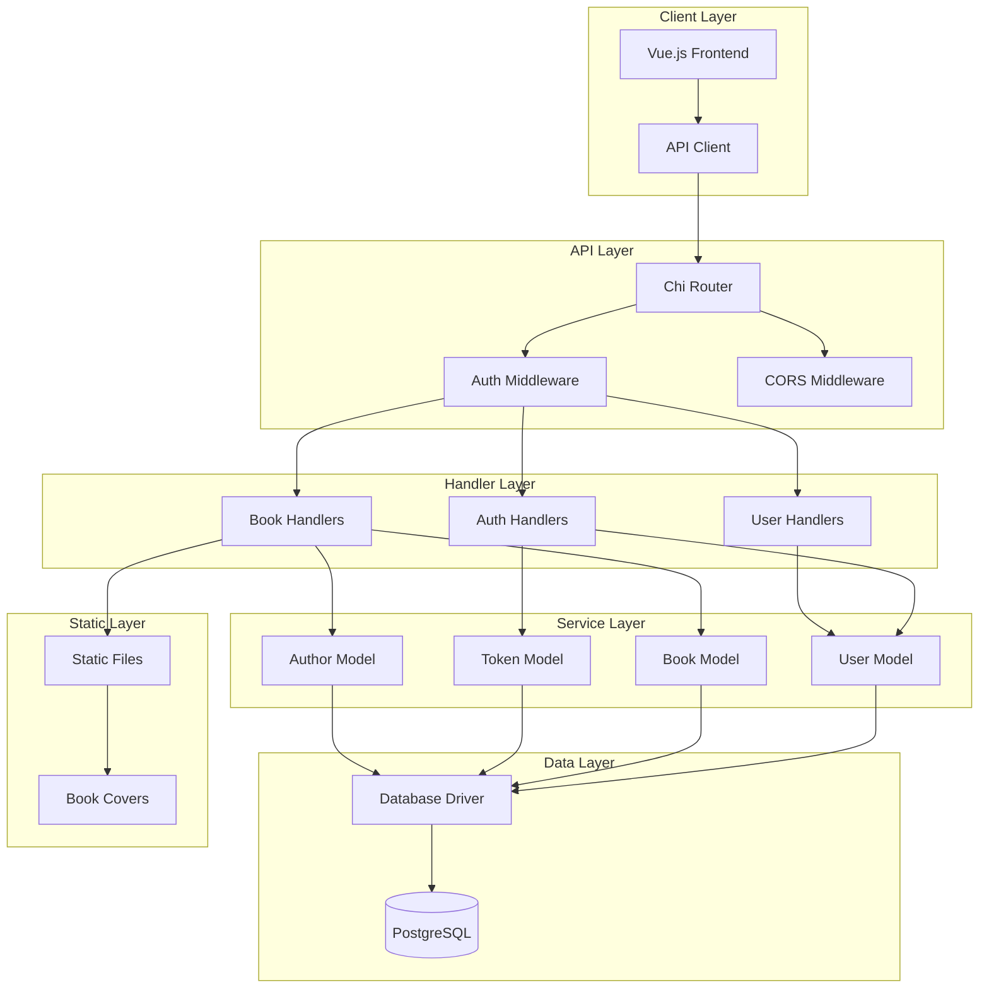
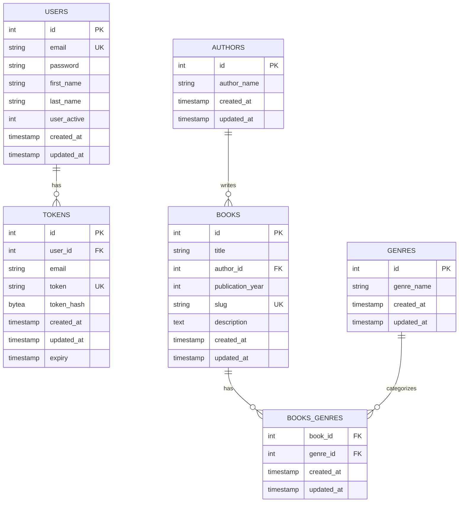
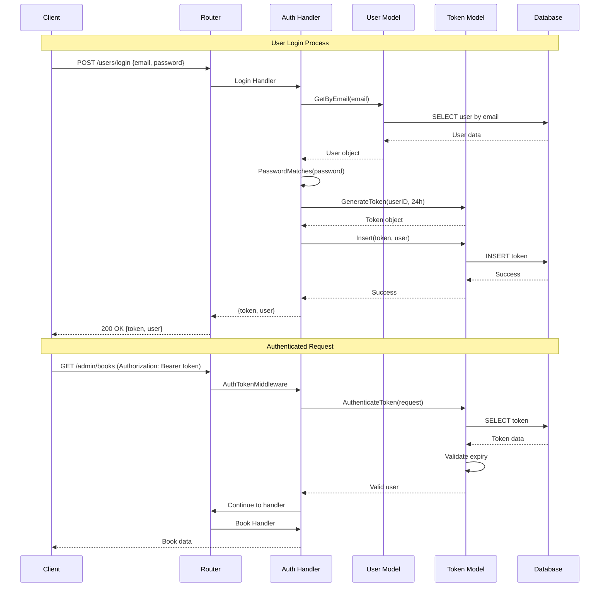
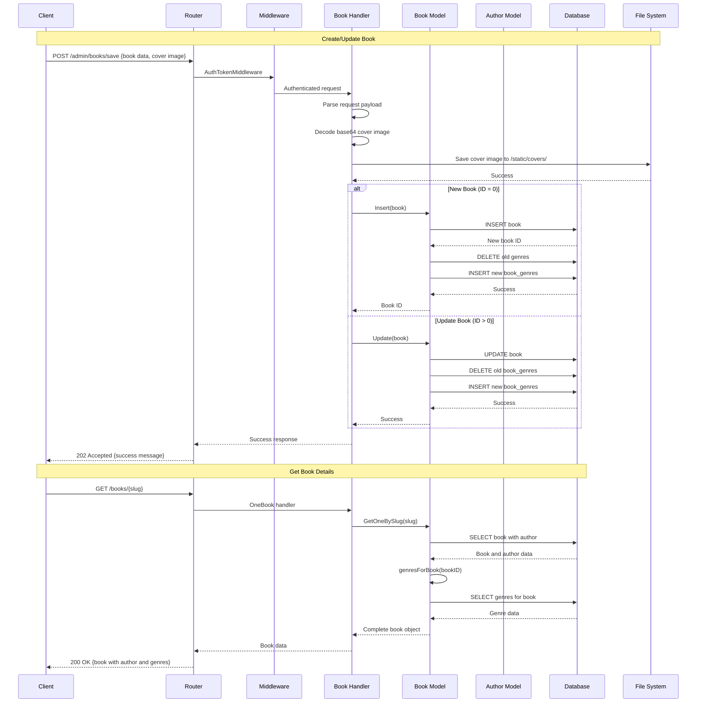
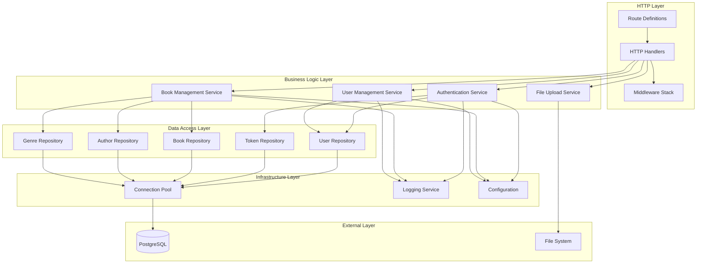

# Book Management API

A RESTful API backend service built with Go, designed to work with a Vue.js frontend for managing books, authors, and users with authentication capabilities.

## Features

- **User Authentication**: JWT-like token-based authentication system
- **Book Management**: CRUD operations for books with author and genre relationships
- **User Management**: Admin functionality for managing users
- **Author Management**: Support for book authors
- **Genre Support**: Many-to-many relationship between books and genres
- **File Upload**: Cover image upload support for books
- **Middleware**: Authentication and CORS support
- **PostgreSQL Integration**: Full database integration with connection pooling

## Technology Stack

- **Language**: Go
- **Web Framework**: Chi Router v5
- **Database**: PostgreSQL with pgx driver
- **Authentication**: Token-based authentication
- **Image Processing**: Base64 encoding for cover uploads
- **Logging**: Structured logging with built-in Go logger
- **Development**: Docker Compose for local development

## Project Structure

```
.
├── cmd/api/              # Application entry point and HTTP handlers
│   ├── main.go          # Main application entry
│   ├── handlers.go      # HTTP request handlers
│   ├── routes.go        # Route definitions
│   ├── middleware.go    # Authentication middleware
│   └── helpers.go       # Helper functions
├── internal/            # Internal application packages
│   ├── data/           # Data models and database operations
│   │   ├── model.go    # Base models and database connection
│   │   └── books.go    # Book-related data operations
│   └── driver/         # Database connection driver
│       └── driver.go   # PostgreSQL connection setup
├── db-data/            # PostgreSQL configuration
├── docker-compose.yml  # Docker services configuration
└── Makefile           # Build and development commands
```

## Quick Start

1. **Prerequisites**
   - Go 1.21+
   - PostgreSQL 13+
   - Docker and Docker Compose (optional)

2. **Environment Setup**
   ```bash
   # Start PostgreSQL with Docker Compose
   docker-compose up -d
   
   # Set environment variables
   export DSN="host=localhost port=5432 user=postgres password=password dbname=books sslmode=disable timezone=UTC connect_timeout=5"
   export ENV=development
   ```

3. **Build and Run**
   ```bash
   # Build the application
   make build
   
   # Run the application
   make run
   ```

4. **API Access**
   - API Server: `http://localhost:8082`
   - Static Files: `http://localhost:8082/static/`

## API Endpoints

### Authentication
- `POST /users/login` - User login
- `POST /users/logout` - User logout
- `POST /validate-token` - Token validation

### Public Endpoints
- `GET /books` - Get all books
- `GET /books/{slug}` - Get book by slug

### Admin Endpoints (Requires Authentication)
- `POST /admin/users` - Get all users
- `POST /admin/users/save` - Create/Update user
- `POST /admin/users/get/{id}` - Get user by ID
- `POST /admin/users/delete` - Delete user
- `POST /admin/books/save` - Create/Update book
- `POST /admin/books/delete` - Delete book
- `POST /admin/books/{id}` - Get book by ID
- `POST /admin/authors/all` - Get all authors

## Architecture Diagrams

### System Architecture


### Entity Relationship Diagram (ERD)


### Authentication Flow Sequence Diagram


### Book Management Flow Sequence Diagram


### Service Layer Architecture


## Database Schema

### Users Table
- Primary authentication entity
- Stores user credentials and profile information
- Supports active/inactive status

### Tokens Table
- JWT-like token management
- Links to users for authentication
- Includes expiry management

### Books Table
- Central entity for book information
- Links to authors (many-to-one)
- Includes slug for SEO-friendly URLs
- Supports cover image storage

### Authors Table
- Author information
- One-to-many relationship with books

### Genres Table
- Genre categories
- Many-to-many relationship with books via junction table

### Books_Genres Junction Table
- Implements many-to-many relationship
- Links books to multiple genres

## Development Commands

```bash
# Build application
make build

# Run application  
make run

# Start application
make start

# Stop application
make stop

# Restart application
make restart

# Clean build artifacts
make clean
```

## Configuration

### Environment Variables
- `DSN`: PostgreSQL connection string
- `ENV`: Environment (development/production)

### Default Configuration
- **Port**: 8082
- **Database Timeout**: 3 seconds
- **Token Expiry**: 24 hours
- **Max DB Connections**: 5
- **Connection Lifetime**: 5 minutes

## Security Features

- **Token-based Authentication**: Secure API access
- **Password Hashing**: bcrypt for password security
- **CORS Configuration**: Cross-origin request handling
- **SQL Injection Protection**: Parameterized queries
- **Input Validation**: Request payload validation

## API Response Format

```json
{
    "error": false,
    "message": "Success message",
    "data": {
        // Response data
    }
}
```

## Error Handling

The API uses consistent error response format:
```json
{
    "error": true,
    "message": "Error description"
}
```

Common HTTP status codes:
- `200 OK`: Successful GET requests
- `201 Created`: Successful resource creation
- `202 Accepted`: Successful POST/PUT requests
- `400 Bad Request`: Invalid request data
- `401 Unauthorized`: Authentication required/failed
- `500 Internal Server Error`: Server-side errors

## Testing

The project includes test files for:
- Handlers (`handlers_test.go`)
- Routes (`routes_test.go`)
- Models (`models_test.go`)
- Helpers (`helpers_test.go`)

Run tests with:
```bash
go test ./...
```
